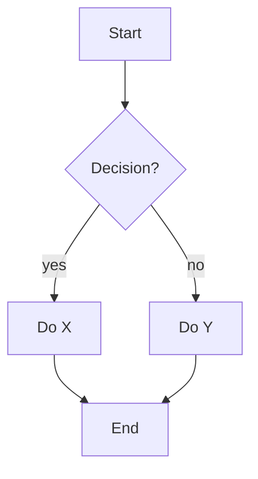
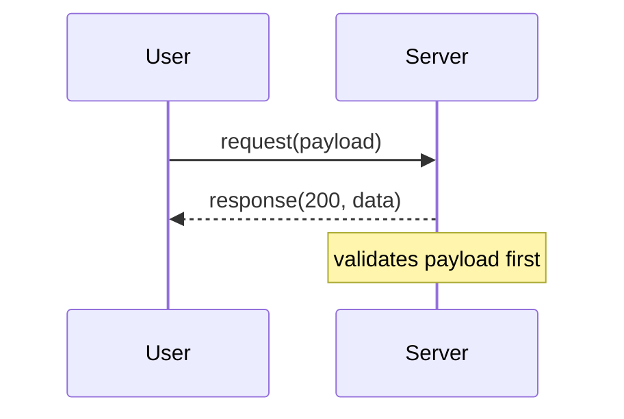
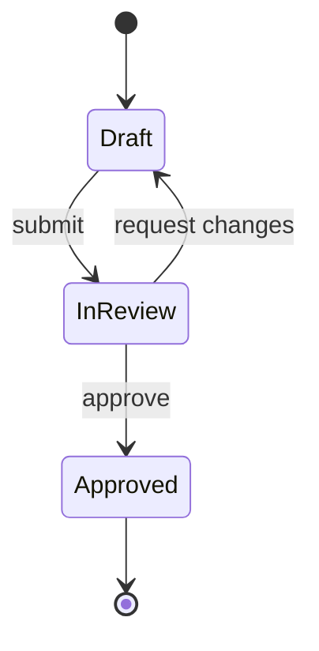
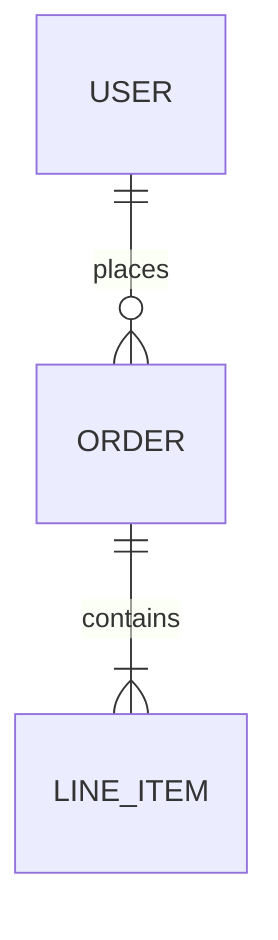
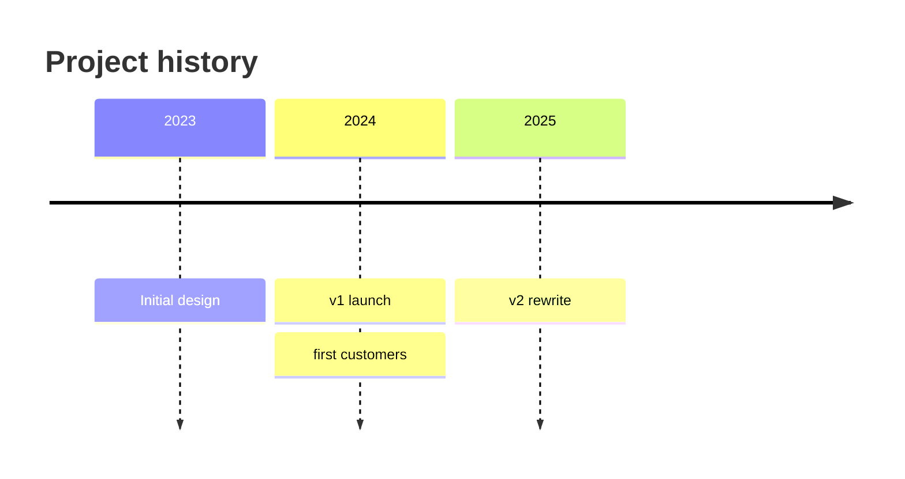
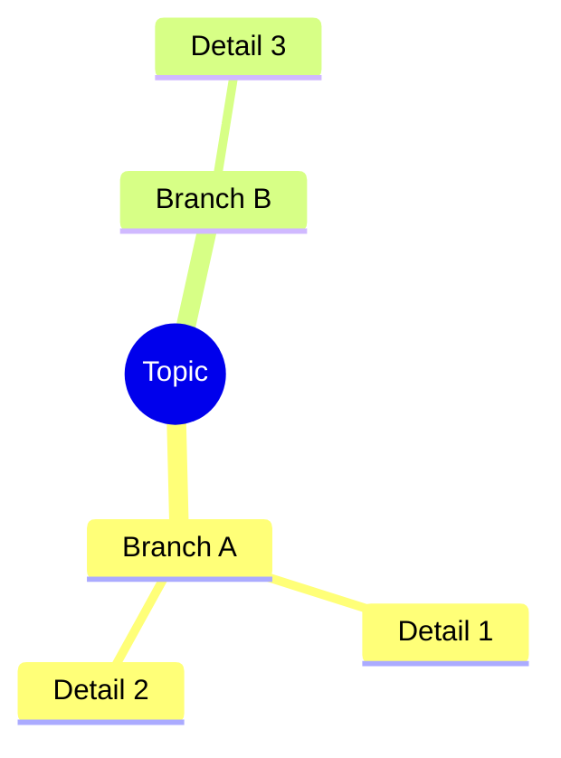

# Mermaid diagram syntax quick reference

Pick the type by content shape (see the table in SKILL.md), then use the minimal syntax below.
Keep labels short; put detail in the walkthrough text, not crammed into node labels.

---

## Flowchart — process, hierarchy, cause/effect

- `TD` (top-down) for sequential/hierarchical reading order; `LR` for wide/parallel structures.
- Shapes: `[Rectangle]` a step, `{Diamond}` a decision, `([Rounded])` a start/end,
  `((Circle))` a small terminal node, `[[Subroutine]]` a call-out to another process.
- Label every edge that isn't an obvious "then": `-->|calls|`, `-->|depends on|`.
- Group related nodes with `subgraph Name ... end` when a diagram spans distinct zones (e.g.
  "Client" vs "Server").

## Sequence diagram — interactions over time between actors/systems

- `->>` solid arrow = a call/request; `-->>` dashed = a response/return.
- Use `Note over X` / `Note over X,Y` to attach a fact that doesn't fit as a message.
- Use `alt`/`else`/`end` for branching interactions, `loop`/`end` for repetition.

## State diagram — lifecycle / status transitions

- `[*]` marks start/end.
- Label every transition with the trigger/event that causes it.

## ER diagram — entities and relationships (data model, system components)

- Cardinality tokens: `||` exactly one, `o{` zero-or-many, `|{` one-or-many, `o|` zero-or-one.
- Use for genuine entity-relationship content (data models, ownership structures) — not as a
  generic substitute for a flowchart.

## Timeline — chronology / history

- One section per time point; multiple events at the same point are colon-separated.

## Mindmap-style hierarchy (when a nested outline works better than a tree flowchart)

- Good for taxonomies/categorizations where the "flow" framing of a flowchart feels forced.

## When not to use Mermaid at all

- **Comparisons across items on shared dimensions** → a plain Markdown table almost always beats
  a diagram.
- **Pure prose argument (claim + support)** → a nested bullet outline is more faithful than
  bending it into boxes and arrows.
- **Real quantitative data** (measurements, trends) → don't fake a chart in Mermaid; either use a
  table or, if a real chart is warranted, follow the `dataviz` skill's guidance.
